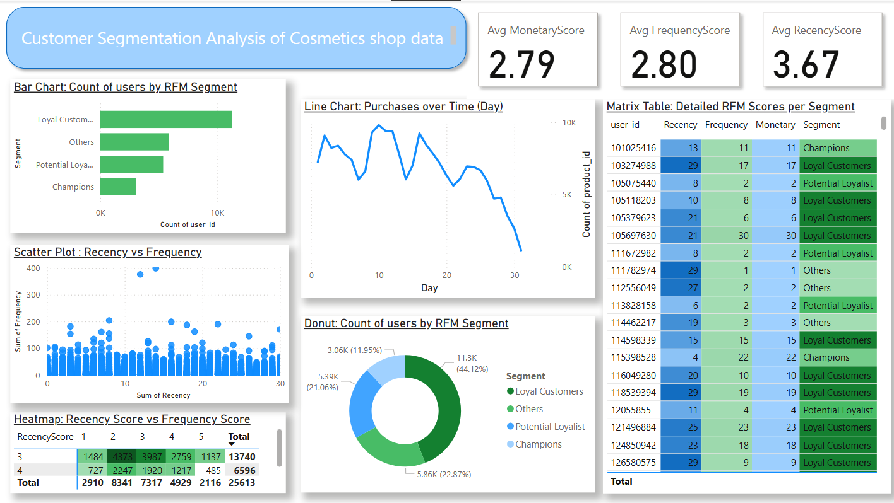

# Customer Behavior Segmentation Using RFM Analysis on E-commerce Cosmetics Data


This project applies **RFM (Recency, Frequency, Monetary)** analysis to segment customers of a cosmetics e-commerce platform based on their purchasing behavior. Using **Power BI**, we analyze transactional data to identify key customer segments such as loyal buyers, potential churners, and high-value customers. The final output includes interactive visualizations that aid in strategic business decisions, personalized marketing, and customer retention.


---

**RFM** is a well-established marketing technique that evaluates customer value based on three key metrics:

- **Recency**: How recently a customer made a purchase.  
  → *Customers with recent purchases are more likely to engage again.*

- **Frequency**: How often a customer makes purchases.  
  → *Frequent buyers are often more loyal and valuable.*

- **Monetary**: How much money a customer spends.  
  → *High spenders contribute significantly to revenue.*

> ⚠️ Note: Since price data was unavailable in the dataset, the **Monetary value was approximated using the count of purchases** per customer.

---

## 📦 Dataset Summary

- **Source**: [Kaggle – E-Commerce Events History in Cosmetics Shop](https://www.kaggle.com/datasets/mkechinov/ecommerce-events-history-in-cosmetics-shop)
- **Description**: The dataset includes event-level records for a cosmetics e-commerce platform.
- **Key Columns**:
  - `user_id`: Anonymized customer ID
  - `event_time`: Timestamp of the event
  - `event_type`: Type of event (e.g., `view`, `cart`, `purchase`)
  - `product_id`: Unique product identifier
  - `category_code`: Product category
  - `brand`: Brand name
  - `price`: Product price (largely missing)

- **Scope of Analysis**: We focused only on **purchase events** for calculating RFM metrics.

---

## 📈 Tools Used

- **Power BI** for data preprocessing, modeling, and visualization
- **DAX (Data Analysis Expressions)** for RFM metric calculations
- **Kaggle** for data sourcing

---
## Data Preprocessing & RFM Calculation (Power BI)

##  Dataset Link

**Source**: [Kaggle – E-Commerce Events History in Cosmetics Shop](https://www.kaggle.com/datasets/mkechinov/ecommerce-events-history-in-cosmetics-shop)

---

## Step-by-Step Preprocessing in Power BI

###  1. Load the Dataset
- Open Power BI.
- Load the `.csv` file using **Get Data → Text/CSV**.

---

###  2. Clean Column Data Types
- Convert `event_time` column to **Date/Time**.
  - Error may occur due to UTC format; fix using Power Query:
    ```
    = Table.TransformColumnTypes(Source,{{"event_time", type datetime}})
    ```
- Convert `category_code`, `brand` to **Text**.
- Replace null values in `category_code` or `brand` (optional: use `"Unknown"`).

---

###  3. Filter for Purchase Events
- In Power Query or via Power BI filters:
  - Keep only rows where `event_type = "purchase"`.

---

### 4. Remove Unnecessary Columns
- Keep only relevant columns:  
  `user_id`, `event_time`, `product_id`, `event_type` (optional), `category_code`.

---

###  5. Rename the Cleaned Table (Optional)
- Rename the table to something meaningful like:  
  `Purchases`

---

##  RFM Calculation in Power BI using DAX

> ⚠️ Since there is no price data, **Monetary value** is approximated using **purchase count**.

---

### 1. Create a New Table for RFM

Go to **Modeling → New Table** and paste:

```dax
RFM = 
SUMMARIZE(
    Purchases,
    Purchases[user_id],
    
    // User's last purchase
    "LastPurchaseDate", CALCULATE(MAX(Purchases[event_time])),
    
    // Reference: overall latest date in dataset
    "MaxPurchaseDate", CALCULATE(MAX(Purchases[event_time]), ALL(Purchases)),
    
    // Recency = how long ago the last purchase was
    "Recency", 
        DATEDIFF(
            CALCULATE(MAX(Purchases[event_time])),
            CALCULATE(MAX(Purchases[event_time]), ALL(Purchases)),
            DAY
        ),

    // Frequency = how many purchases by user
    "Frequency", COUNTROWS(Purchases),

    // Monetary = proxy as # of purchases (no price data)
    "Monetary", DISTINCTCOUNT(Purchases[product_id])
)
```
### 2. Create RFM Scores (Optional Binning)

You can assign scores 1–5 for each RFM metric by creating new calculated columns:

```dax
RecencyScore = 
SWITCH(TRUE(),
    RFM[Recency] <= 7, 5,
    RFM[Recency] <= 14, 4,
    RFM[Recency] <= 30, 3,
    RFM[Recency] <= 60, 2,
    1
)

FrequencyScore = 
SWITCH(TRUE(),
    RFM[Frequency] >= 20, 5,
    RFM[Frequency] >= 10, 4,
    RFM[Frequency] >= 5, 3,
    RFM[Frequency] >= 2, 2,
    1
)

MonetaryScore = 
SWITCH(TRUE(),
    RFM[Monetary] >= 20, 5,
    RFM[Monetary] >= 10, 4,
    RFM[Monetary] >= 5, 3,
    RFM[Monetary] >= 2, 2,
    1
)
```
### 3. Assign Customer Segment

```dax
Segment = 
SWITCH(
    TRUE(),
    RFM[RecencyScore] >= 4 && RFM[FrequencyScore] >= 4 && RFM[MonetaryScore] >= 4, "Champions",
    RFM[RecencyScore] >= 3 && RFM[FrequencyScore] >= 3, "Loyal Customers",
    RFM[RecencyScore] >= 4 && RFM[FrequencyScore] <= 2, "Potential Loyalist",
    RFM[RecencyScore] <= 2 && RFM[FrequencyScore] >= 4, "At Risk",
    "Others"
)

```
## Visualizations

### 1. Bar Chart: Count of Users by RFM Segment
Purpose: Show how many customers fall into each RFM-based group.

### 2. Donut Chart: Share of Each Segment
Purpose: Visualize the proportion of customer types.

### 3. Heatmap: RecencyScore vs FrequencyScore
Purpose: Spot patterns in user engagement (e.g., frequent + recent users).

### 4.  Line Chart: Purchases Over Time
Purpose: Show purchasing trends.

### 5.  Matrix Table: Detailed RFM Scores per Segment
Purpose: Show a data-rich view of RFM scores.

### 6. Scatter Plot: Frequency vs Recency 

